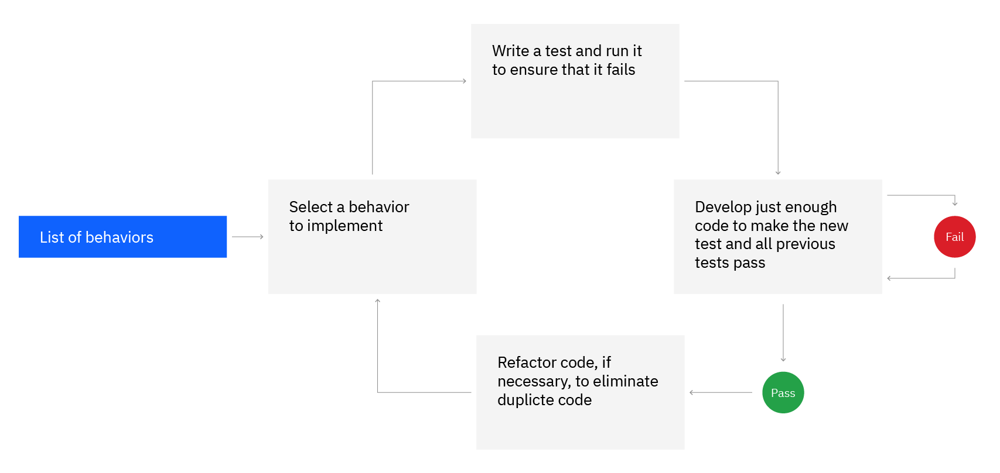

# Contents
개요
What is TDD?
Why use TDD?

출처 : https://www.ibm.com/garage/method/practices/code/practice_test_driven_development/
## 개요
TDD는 extreme programming에서 기인한 방법으로, 팀과 함께 코드가 특정 동작이나 사례에서 예상대로 동작하도록 하는 것입니다. 첫번째 시도에서 최적 해, optimum solution을 찾는 것이 아니라 코드와 테스트가 반복적으로 함께 built 구축됩니다. 개발 팀은 TDD를 통해 test coverage를 보장하고 코드 품질을 향상시키며, delivery pipeline의 기초를 다지고 지속적인 delivery를 지원합니다.

  
test coverage vs code coverage

  test Coverage는 S/W test에서 얼마나 많은 코드가 테스트되었는지 측정하는 지표입니다. Test Suite의 실행을 통해 어떤 부분이 테스트되었는지 확인합니다.

code coverage는 실행된 코드의 평가로, test에 의하여 실행된 라인의 수 등 양적 측정입니다. test coverage는 test case가 전체 기능 요구 사항을 포함하는지 여부를 평가하기 위해 사용됩니다.

핵심목표는 모두 응용 프로그램 코드의 품질 평가입니다.

출처 : https://testsigma.com/blog/code-coverage-vs-test-coverage/
  

  

  
Dynamic Code Coverage

  Dynamic Code Coverage(동적 코드 커버리지)는 팀이 S/W 코드의 untested portions을 식별가능하도록 합니다. 이 방법은 더 효과적인 S/W testing입니다. Effective software testing은 S/W 품질의 기본요소이며, DCC를 사용함으로서 팀은 즉시 코드 품질을 향상시킬 수 있습니다. DCC는 시장의 다른 테스트 도구와 근본적으로 다릅니다. 
  recompile이 필요하지 않고
  상세한 coverage measurement 제공
  개발, 테스트 및 production enviroments
  운영 환경에서는 프로세스의 모든 함수를 측정하며, 단일 모듈뿐만 아니라 제3자(3rd party) 코드도 측정
  출처 : redhat
  

## What is TDD?

TDD의 기본 concept은 모든 production code가 testcase에 대한 response로 작성되어야 한다는 것입니다. Uncle Bob라고 알려진, Robert C. Martin은 아래의 세가지 법칙으로 TDD를 설명합니다.

  <ol>
    <li>You are not allowed to write any production code unless it is to make a failing unit test pass. </li>
    <li>You are not allowed to write any more of a unit test than is sufficient to fail </li>
    <li>you are not allowed to write any more production code than is sufficient to pass the failing unit test</li>
  </ol>
  

해석

1. 실패중인 test를 통과하기 전까지 어떠한 production code도 작성할 수 없습니다

2. 필요 이상으로 많은 unit 테스트를 작성하지 않아야 합니다

3. unit test에 해당하는 만큼씩만 production code를 작성해야 합니다

Javier Saldana는 아래의 두가지 규칙을 제시합니다

fail할 만큼만 단위 검정을 작성합니다

실패한 unit test를 통과할 수 있을 만큼만 production code를 작성합니다
  

## Why use TDD?
TDD는 아래와 같은 이점을 제공합니다
  <ol>

  <li>코드가 robust, 견고하게 작성되어 빠른 혁신과 지속적인 전달이 가능합니다</li>
  <li>코드를 유연하고 확장가능하게 합니다. refactoring 되거나 이동할 때 코드가 손상될 위험을 최소화합니다.</li>
  <li>테스트들 자체도 테스트되었습니다. 테스트의 핵심 특성은 fail 가능하다는 것이며, 개발 팀은 새로운 test들이 fail 가능한지 확인합니다</li>
  <li>테스트하기 쉬운 코드들을 만들어냅니다</li>

  <li>필요한 기능만이 구현되기에 낭비되는 노력이 없습니다.</li> 

  </ol>

  

## Key practices for TDD

tdd의 핵심 실천 방법
1. project leadership(프로젝트를 주도하는 리더나 상위 관리자)에게 buy-in(지지, 동의)를 얻으세요

2. 개발 팀이 TDD를 이해하게 ensure하세요. test를 작성하는 것이 때때로 code를 작성하는 것보다 더 많은 노력을 필요로 합니다.

3. 개발된 모든 테스트를 development pipeline에 부분적으로 Run하세요. 실패하는 테스트는 파이프라인을 중단하세요.

4. TDD로 얻은 value를 측정하고 모니터링 하세요

## Red/Green/Refactor cycle

### 1. Red phase
테스트 작성(구현된 코드가 있다고 가정한 상태에서)
    구현하려는 동작에 대한 자동화된 코드를 작성합니다. 
user 요구사항을 기반으로, 구현되었다고 가정한 코드의 일부에 대한 테스트를 어떻게 작성할 지 결정합니다.
이는 실제로 구현을 하여 distracted, 집중이 분산되지 않은 상태로 코드의 [externals of the code](#externals-of-the-code)에 대하여 생각해볼 수 있는 좋은 기회입니다.
  a. Interface가 어떻게 보여야 하는지,  
b. 해당 인터페이스의 caller는 어떠한 동작을 수행해야 하는지,  
c. 그 인터페이스가 clean하고 consumable 사용하기 편리한지 생각해보십시오. 

#### externals of code

externals of code

TDD에서 externals of code에 대하여 생각하는 것은 코드를 작성하기 전에 코드와 상호작용하는 인터페이스를 고려하는 것을 의미합니다. 
인터페이스를 어떻게 설계하고 어떠한 동작을 원하는지 생각하며, 이를 기반으로 Test를 작성합니다. 이를 통해 코드가 외부와의 상호 작용에서 예상대로 동작하는지 검증할 수 있습니다.

### 2. Green Phase
최소한의 코드로 테스트 통과 
    당신은 테스트를 통과할 만큼씩 production code를 작성하며,  알고리즘을 작성하거나 performance, 성능에 대해서 고민하지 않습니다. 
코드가 중복될 수도 있고, best practice, 좋은 프로그래밍 관행을 어길 수도 있습니다. 
가장 간단한 일에 addressing, 집중함으로서  당신의 코드는 에러가 줄어들고 (less prone to errors), 
테스트 되지 않은 코드와 테스트가 끝난 코드가 섞이는 것을 방지할 수 있습니니다.  

wind up(컴퓨터 용어는 아님)

회사의 해산 또는 청산: "winding up"은 회사가 자산을 처분하고 채무를 상환하며 종료하는 과정을 의미합니다. 이는 회사의 활동을 완전히 중단하고 회사를 해체하는 과정을 말합니다. 회사의 경영 불능, 부채 문제, 손실 등으로 인해 회사가 해산되는 경우 "winding up" 절차가 진행될 수 있습니다.
일상적인 의미의 마무리 또는 정리: "winding up"은 어떤 일이나 사건의 마무리 단계를 의미하기도 합니다. 예를 들어, "We're winding up the meeting" (우리는 회의를 정리하고 마무리하고 있습니다)라고 말할 수 있습니다. 이는 회의가 점차 종료되고 마무리되고 있는 상황을 나타냅니다.
 
본문의
'avoid winding up with a mix of code'
-> 코드가 섞여서 망하는 것을 의미 하는 것으로 보임

### 3. Refactor phase
코드 개선 
code duplication, 코드 중복을 제거하면 일반적으로 추상화를 이끌어냅니다.
이 단계에서는 테스트를 변경할 필요가 없습니다. 중복을 제거하며, 읽기 쉽고 유지 보수가 용이한, 더 나은 구조와 설계를 추구하며 코드를 개선하는 단계입니다.

code duplication

코드 중복(Code duplication)은 소프트웨어 개발에서 흔히 발생하는 문제입니다. 이는 동일한 또는 유사한 코드 블록이 여러 곳에 중복되어 사용되는 상황을 가리킵니다. 코드 중복은 일반적으로 다음과 같은 문제를 초래할 수 있습니다:
  
1. 유지보수의 어려움: 코드 중복은 변경이 필요한 경우 여러 곳에 동일한 변경을 반복해야 함을 의미합니다. 이는 코드를 수정하고 유지보수하는 데 시간과 노력이 더 많이 필요하게 만듭니다. 또한, 중복된 코드의 존재로 인해 버그가 발생할 수 있는 가능성도 증가합니다.
 
2. 코드 크기 증가: 중복된 코드의 존재로 인해 소스 코드의 크기가 늘어납니다. 이는 프로젝트의 전체적인 복잡도를 증가시키고, 디버깅과 테스트를 어렵게 만들 수 있습니다. 또한, 중복된 코드를 유지보수하는 데 필요한 자원과 시간도 증가합니다.
 
3. 일관성 부족: 중복된 코드는 코드베이스에서 일관성을 유지하기 어렵게 만듭니다. 동일한 로직을 서로 다른 방식으로 구현한 중복 코드들은 버그의 원인이 될 수 있습니다. 또한, 중복 코드는 코드 리뷰 및 팀 협업 과정에서도 문제를 야기할 수 있습니다.
  
코드 중복을 해결하기 위해 여러 가지 방법이 있습니다. 일반적으로는 다음과 같은 접근 방식을 사용합니다:
  
1. 함수나 메서드 추출: 중복된 코드 블록을 함수나 메서드로 추출하여 동일한 기능을 수행하도록 합니다. 추출한 함수는 여러 곳에서 호출될 수 있으므로 중복을 제거하고 유지보수성을 향상시킵니다.
 
2. 상속 또는 인터페이스 활용: 중복된 코드를 상속 관계로 재구성하거나 인터페이스를 도입하여 공통 기능을 재사용할 수 있습니다. 이를 통해 중복 코드를 최소화하고 코드의 재사용성을 높일 수 있습니다.
 
3. 유틸리티 클래스 또는 라이브러리 사용: 자주 사용되는 기능을 라이브러리나 유틸리티 클래스로 추출하여 중복을 제거할 수 있습니다. 이를 통해 코드베이스 전체에서 공통 기능을 재사용할 수 있습니다.

